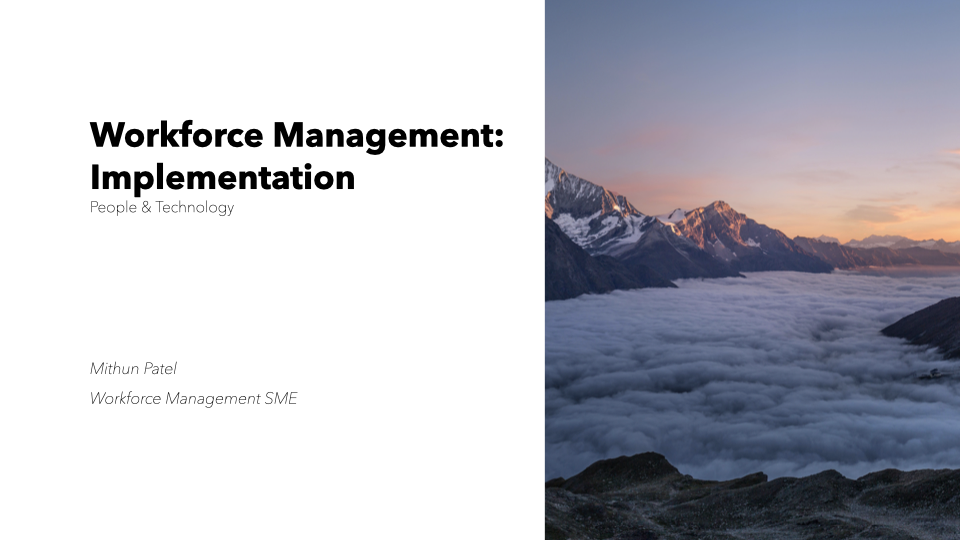
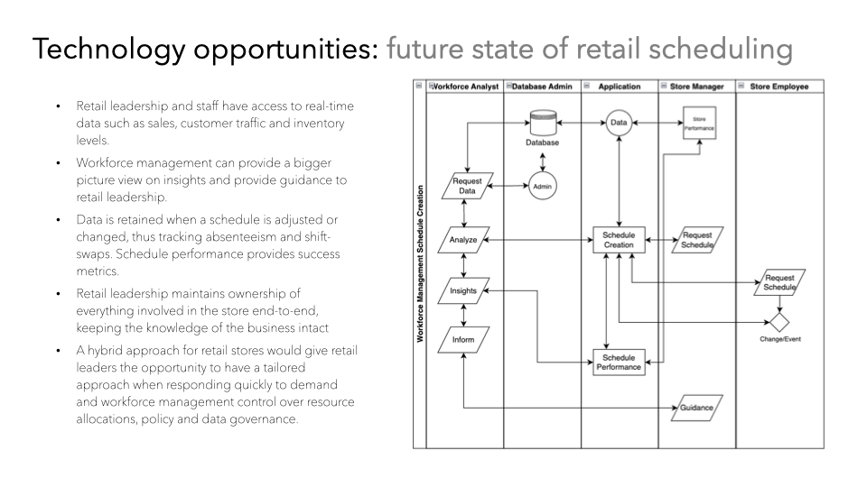
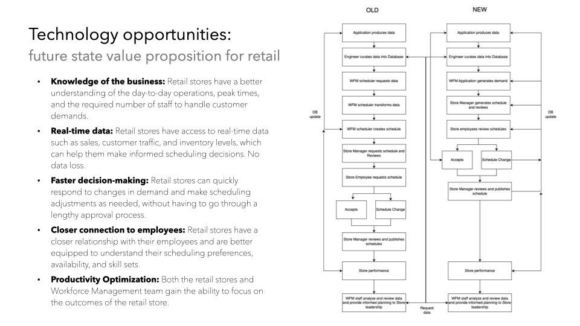
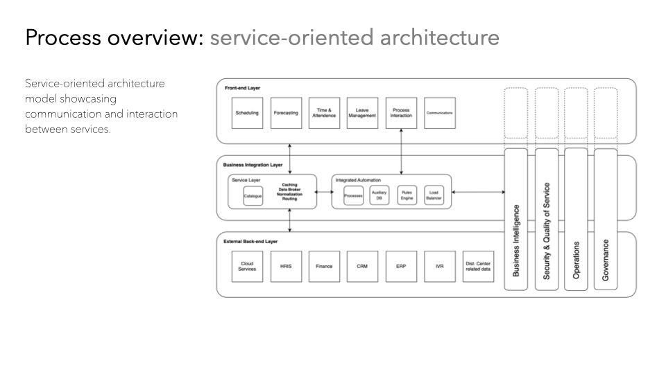

## Subject Expertise(/Workforce_Management_Models/Workforce Management Implemetation.pdf) ##
*sample work - Workforce Management Implementation Project Plan and Scoping

*sample work - Workforce Management: Swimlane diagram of future state of an excel based innovation

*sample work - Workforce Management: value diagram of process savings

*sample work - Workforce Management: service-oriented architecture

*sample work - UML diagram: process evaluation

<!-- ABOUT THE PROJECT -->
## Scope of **Work**
* Highlight Subject Matter Expertise
* process of currating
* build models in python that assist with future automation
* create the key ingredients to success
* Experiment for outcomes with varying variables
* simulate various outcomes

## Future Scope of **Work**
* build simple applications that a user can input and manipulate
* simplify and tighten code base
*introduce & validate forecast model into dictionary lists

### Built With

This section should list any major frameworks/libraries used to model this project. 

(<a href="#readme-top">back to top</a>)

### Math utilization
* Import math
* Erlang C 
* Regression
* Holt-winters
